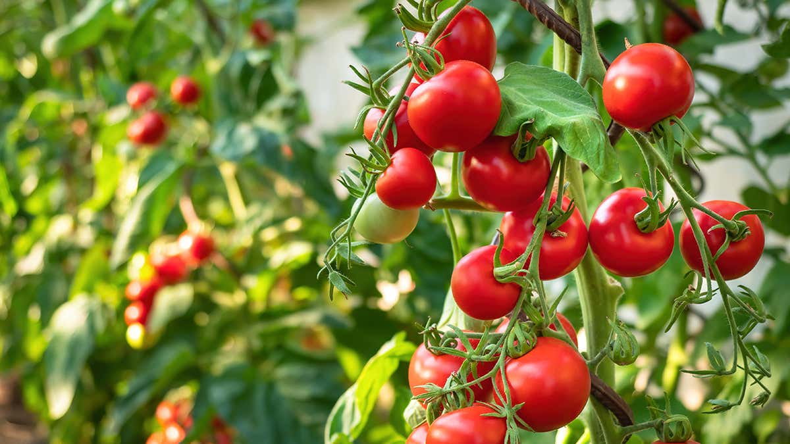

# Project to detect the type of Disease on a Tomato plant using its leaf 

## Description : 
* ### Used Transfer Learning to create a model using Tensorflow.
* ### The transfer learning model used is VGG19.
* ### The accuracy of the model in validation data turn out to be 87%
* ### With a validation loss of less than 0.3

## The VGG model with transfer learing look like :

## Source:
* ### The dataset was hosted on kaggle
* ###  <https://www.kaggle.com/noulam/tomato>
* ### The dataset contains 10 Categories, displaying the 9 different type of diseases and one category for healthy tomato.

